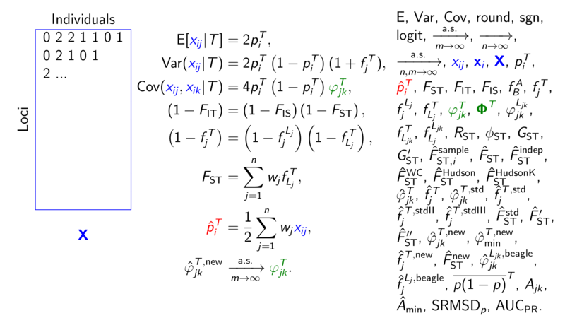

# kinshipsymbols: a LaTeX package providing math symbols for papers and presentations in statistical genetics

This LaTeX package defines consistent mathematical symbols for statistical genetics, particularly relating to the kinship model and FST.

In addition to providing a long list of symbols, the package has two options that alter the behavior of some of the most common symbols.
Option `color` highlights genotypes (blue), kinship coefficients (dark green), and the standard ancestral allele frequency estimator (red), which is useful for Beamer presentations.
Option `noT` removes the ancestral population T superscript from all symbols that contain it (for simpler presentations).
